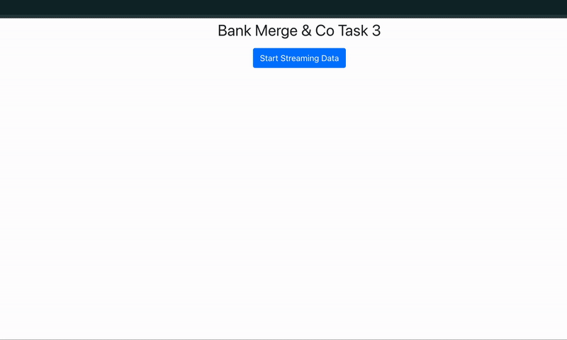

# JPMC Software Engineering Virtual Experience – Task 3

This task is part of JPMorgan Chase's Software Engineering Virtual Experience on Forage. It builds on Task 2 by using JPMorgan’s open-source library **Perspective** to create a live trading dashboard with data visualization and real-time alerting.

---

## 💡 Project Overview

The goal of Task 3 is to implement a trading interface that:

- Continuously calculates the **price ratio** of two stocks (`ABC` and `DEF`)
- Monitors that ratio against predefined upper/lower thresholds
- **Triggers a visual alert** when the ratio breaches those bounds
- Visualizes all of this in real-time using the **Perspective** library

---

## 🧠 My Contributions

- Extended the frontend to compute and visualize:
  - `price_abc`, `price_def`, and `ratio`
  - Thresholds: `upper_bound`, `lower_bound`
  - Real-time `trigger_alert` events when the ratio goes out of bounds
- Integrated JPMorgan’s Perspective open-source charting framework into the app
- Simulated realistic alert behavior and tested the visualization under dynamic input

---

## 🛠️ Technologies Used

- ⚛️ React + TypeScript
- 📈 Perspective (open-source library)
- 🐍 Python (data feed server)
- 📦 npm + Node.js

---

## 🚀 How to Run the Project Locally

### 1. Start the Python Backend

```bash
# Create and activate virtual environment
python3 -m venv venv
source venv/bin/activate  # macOS/Linux
# OR
venv\Scripts\activate     # Windows

# Install dependencies and start server
pip install -r datafeed/requirements.txt
python3 datafeed/server3.py
```

By default, the backend will run at: `http://localhost:8080`

---

### 2. Start the React Frontend (in a new terminal)

```bash
npm install
npm start
```

This will launch the app at: `http://localhost:3000`

---

## 🖼️ What to Expect

<p align="center">
  
</p>

> 🔴 The red line shows alert points when the `ratio` exceeds defined bounds.  
> While `trigger_alert` is rendered as a continuous line due to library limitations, the logic correctly identifies breach events.

---

## 💭 Reflection

This task helped me deepen my understanding of real-time data visualization, ratio-based financial monitoring, and how alert logic can be embedded in visual dashboards. Working with Perspective also exposed me to real-world limitations of data rendering tools, encouraging thoughtful debugging and visual design tradeoffs.
